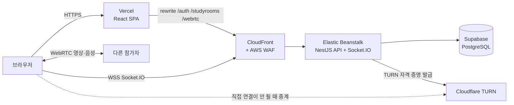
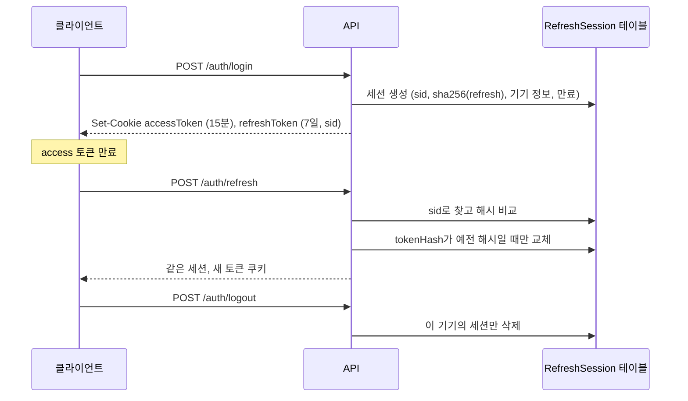
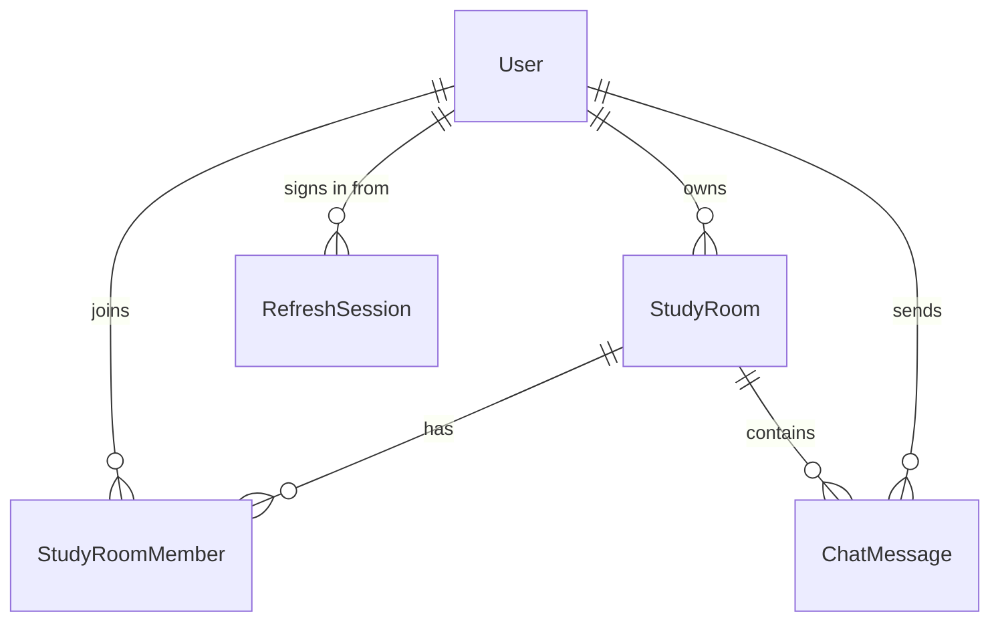

# 모어모어온 (Moremore On) — 백엔드

[English](README.md) | **한국어**

화상·음성 스터디룸을 제공하는 그룹 스터디 서비스 모어모어온의 NestJS API와 Socket.IO 시그널링 서버입니다. React 클라이언트와 화면 캡처는 [moremore-frontend](https://github.com/HyeseongO/moremore-frontend)에 있습니다.

**배포 주소:** https://moremore-frontend.vercel.app (로그인 화면의 **데모 1** 버튼으로 가입 없이 체험)

## 구조



- 브라우저는 REST 요청을 자기 주소로만 보내기 때문에 로그인 쿠키가 같은 사이트 쿠키(`HttpOnly`, `Secure`, `SameSite=Lax`)로 유지됩니다.
- WebSocket은 CloudFront로 직접 연결하고, `GET /auth/socket-token`으로 받은 1분짜리 소켓 토큰으로 인증합니다.
- 영상·음성은 참가자끼리 직접 주고받습니다. 이 서버는 시그널링, 방 멤버십, 채팅을 맡고 TURN 자격 증명을 발급합니다.

## 기술 스택

NestJS 11 · TypeScript · Prisma 6 · PostgreSQL (Supabase) · Socket.IO 4 · Passport (JWT, Google OAuth) · class-validator · helmet · Jest

## REST API

| 구분 | 엔드포인트 |
| --- | --- |
| 인증 | `POST /auth/signup` · `POST /auth/login` · `POST /auth/logout` · `POST /auth/refresh` · `GET /auth/me` · `GET /auth/socket-token` · `GET /auth/check-nickname` · `GET /auth/check-email` |
| 구글 | `GET /auth/google` · `GET /auth/google/callback` · `POST /auth/google/complete` (새 구글 계정의 닉네임 설정) |
| 계정 | `PATCH /auth/me/nickname` · `PATCH /auth/me/password` · `DELETE /auth/me` |
| 스터디룸 | `GET /studyrooms` · `POST /studyrooms` · `GET /studyrooms/my-rooms` · `GET /studyrooms/:id` · `PATCH /studyrooms/:id` · `DELETE /studyrooms/:id` · `GET /studyrooms/invite/:inviteCode` · `POST /studyrooms/join/:inviteCode` · `POST /studyrooms/:id/regenerate-invite` · `DELETE /studyrooms/:id/leave` · `POST /studyrooms/:id/transfer-ownership` |
| WebRTC | `GET /webrtc/ice-servers` (STUN + Cloudflare TURN 자격 증명) |
| 운영 | `GET /health` (DB 연결 확인) |

## Socket.IO 이벤트

| 클라이언트 → 서버 | 서버 → 클라이언트 |
| --- | --- |
| `join-room`, `leave-room` | `existing-users`, `user-joined`, `user-left`, `room-full`, `room-info`, `room-deleted` |
| `offer`, `answer`, `ice-candidate` | `offer`, `answer`, `ice-candidate` (상대 한 명에게 전달) |
| `toggle-audio`, `toggle-video` | `user-toggled-audio`, `user-toggled-video` |
| `send-message`, `get-messages`, `delete-message`, `typing` | `new-message`, `messages-history`, `message-deleted`, `user-typing` |
| `getActiveUsers` | `activeUserUpdate`, `room-count-update` |
| | `error` (`{ code, message }`) |

입장할 때 방 멤버인지와 정원(화상 방 4명, 음성 방 12명)을 확인합니다.

## 인증과 세션

- access 토큰: JWT, 15분, `accessToken` 쿠키
- refresh 토큰: JWT, 7일, `refreshToken` 쿠키. `RefreshSession` 행을 가리키는 세션 ID(`sid`)가 들어 있습니다.
- 로그인할 때마다 그 기기의 세션을 만듭니다. refresh 토큰은 SHA-256 해시로만 저장하고 기기 정보(User-Agent)와 만료 시각을 함께 둡니다. 사용자당 최대 10개이고, 가장 오래 안 쓴 세션부터 정리합니다.
- 토큰 갱신은 같은 세션 안에서 조건부 업데이트(`WHERE id = sid AND tokenHash = 예전 해시`)로 교체하므로, 동시에 두 번 갱신해도 하나만 성공합니다. 해시는 `timingSafeEqual`로 비교합니다.
- 로그아웃은 그 기기의 세션만 지웁니다. 비밀번호를 바꾸면 모든 세션을 지우고 지금 기기에 새 세션을 만듭니다. 탈퇴하면 세션도 함께 삭제됩니다(Cascade).



**이 테이블을 만든 이유:** 예전에는 사용자당 refresh 토큰 하나를 bcrypt 해시로 저장했습니다. 그런데 bcrypt는 입력의 앞 72바이트만 비교하고, JWT의 앞 72바이트는 같은 사용자라면 늘 같아서 예전 refresh 토큰도 계속 통과했습니다. SHA-256으로 바꿔 이 문제를 고쳤고, 기기별 세션으로 여러 기기 동시 로그인도 가능해졌습니다.

## 오류 응답

전역 예외 필터가 모든 HTTP 오류를 같은 형식으로 돌려줍니다.

```json
{ "statusCode": 404, "code": "INVALID_INVITE_CODE", "message": "유효하지 않은 초대 링크입니다." }
```

`code`는 바뀌지 않는 값이고, 프론트가 선택한 언어의 문구로 바꿔 보여줍니다. 예: `INVALID_CREDENTIALS`, `EMAIL_TAKEN`, `NICKNAME_TAKEN`, `STUDYROOM_NOT_FOUND`, `NOT_STUDYROOM_MEMBER`, `INVALID_CURRENT_PASSWORD`, `DEMO_ACCOUNT_READ_ONLY`, `VALIDATION_FAILED`. 코드를 따로 정하지 않은 오류는 `UNAUTHORIZED`처럼 HTTP 상태 이름을 씁니다. 소켓 `error` 이벤트도 같은 `{ code, message }` 형식입니다.

## 데이터 모델



스터디룸 삭제는 삭제 표시(soft delete)로 처리합니다. 회원이 탈퇴하면 그 사람이 방장인 방, 보낸 채팅, 멤버십, 세션이 함께 삭제됩니다.

## 운영

- `GET /health`는 `SELECT 1`로 DB를 확인하고, 하루 한 번 DB에 요청을 보내 무료 Supabase 프로젝트가 일시정지되지 않게 합니다.
- `DEMO_ACCOUNT_EMAILS`에 있는 공개 데모 계정은 닉네임·비밀번호 변경과 탈퇴가 막혀 있습니다(`403 DEMO_ACCOUNT_READ_ONLY`).

## 배포

- Elastic Beanstalk (Node.js 24, Amazon Linux 2023, arm64), 앞단은 CloudFront + AWS WAF
- `npm run bundle`로 빌드하고 `dist`, `package.json`, `package-lock.json`, `prisma`를 zip으로 묶어 "Upload and deploy"로 올립니다.
- DB 마이그레이션은 따로 실행합니다. `main` 브랜치에서 `npx prisma migrate deploy`를 먼저 실행한 뒤 새 번들을 배포합니다. 스키마 변경은 먼저 추가하고 나중에 삭제하는 식으로 하위 호환을 지켜서, 마이그레이션과 배포 사이에도 운영 중인 버전이 계속 동작합니다.

## 로컬 실행

```bash
npm install
cp .env.example .env
npx prisma migrate deploy
npm run start:dev
```

프론트의 기본 `VITE_API_URL`에 맞추려면 `PORT=8000`, `FRONTEND_URL=http://localhost:5173`으로 설정하세요.

| 변수 | 용도 |
| --- | --- |
| `DATABASE_URL`, `DIRECT_URL` | PostgreSQL 연결 (커넥션 풀용, 마이그레이션용 직접 연결) |
| `JWT_SECRET`, `JWT_EXPIRES_IN`, `JWT_REFRESH_SECRET`, `JWT_REFRESH_EXPIRES_IN` | 토큰 서명 키와 유효 기간 (기본 15분, 7일) |
| `GOOGLE_CLIENT_ID`, `GOOGLE_CLIENT_SECRET`, `GOOGLE_CALLBACK_URL` | 구글 OAuth |
| `FRONTEND_URL` | CORS와 Socket.IO에서 허용할 주소, 구글 로그인 뒤 돌아갈 주소 |
| `COOKIE_SAME_SITE`, `COOKIE_DOMAIN` | 쿠키 옵션 (기본 `lax`) |
| `TURN_KEY_ID`, `TURN_KEY_API_TOKEN` | Cloudflare TURN. 없으면 STUN만 돌려줍니다. |
| `DEMO_ACCOUNT_EMAILS` | 변경을 막을 데모 계정 (쉼표로 구분) |
| `NODE_ENV`, `PORT` | 실행 설정 (`PORT` 기본값 8080) |

새로 추가한 모듈의 테스트:

```bash
npx jest src/account src/auth/session.service.spec.ts src/common
```

## 관련 링크

- 프론트엔드: [HyeseongO/moremore-frontend](https://github.com/HyeseongO/moremore-frontend)
- 만든 사람: [@HyeseongO](https://github.com/HyeseongO)
