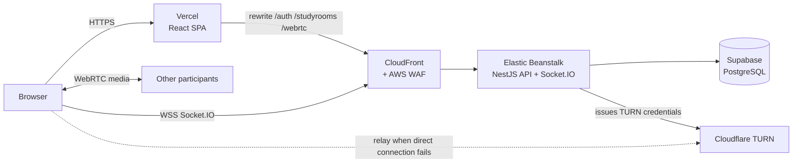
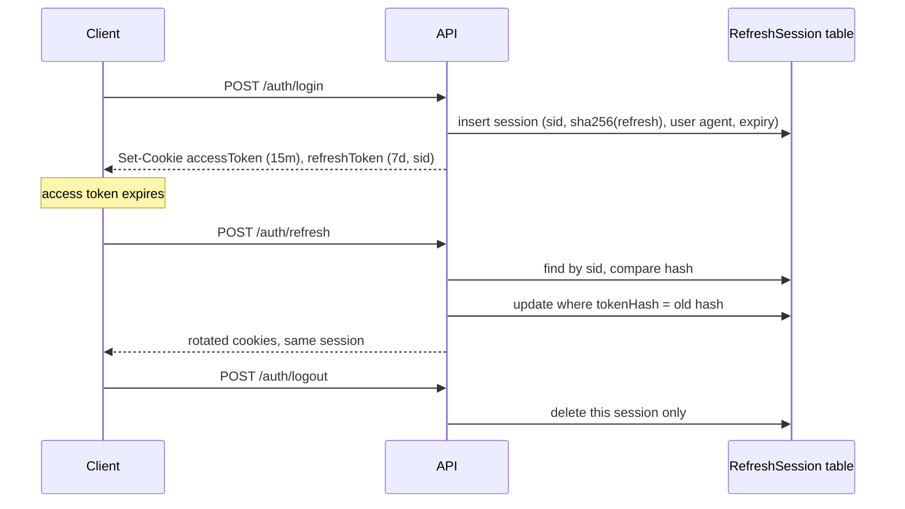
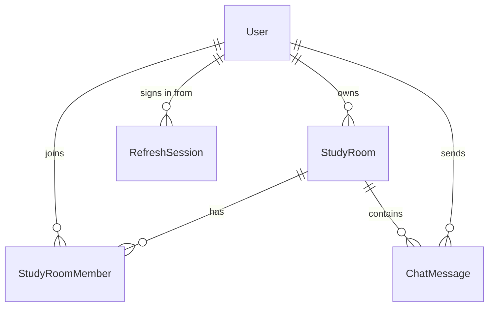

# Moremore On — Backend

**English** | [한국어](README.ko.md)

NestJS API and Socket.IO signaling server for Moremore On, a group study app with video and voice study rooms. The React client and screenshots are in [moremore-frontend](https://github.com/HyeseongO/moremore-frontend).

**Live demo:** https://moremore-frontend.vercel.app (click **Demo 1** on the login page, no sign-up needed)

## Architecture



- The browser only talks to its own origin for REST calls, so auth cookies are first-party (`HttpOnly`, `Secure`, `SameSite=Lax`).
- WebSockets go straight to CloudFront and authenticate with a one-minute socket token from `GET /auth/socket-token`.
- Media flows peer to peer. This server handles signaling, room membership, and chat, and hands out short-lived TURN credentials.

## Tech stack

NestJS 11 · TypeScript · Prisma 6 · PostgreSQL (Supabase) · Socket.IO 4 · Passport (JWT, Google OAuth) · class-validator · helmet · Jest

## REST API

| Area | Endpoints |
| --- | --- |
| Auth | `POST /auth/signup` · `POST /auth/login` · `POST /auth/logout` · `POST /auth/refresh` · `GET /auth/me` · `GET /auth/socket-token` · `GET /auth/check-nickname` · `GET /auth/check-email` |
| Google | `GET /auth/google` · `GET /auth/google/callback` · `POST /auth/google/complete` (pick a nickname for a new Google account) |
| Account | `PATCH /auth/me/nickname` · `PATCH /auth/me/password` · `DELETE /auth/me` |
| Study rooms | `GET /studyrooms` · `POST /studyrooms` · `GET /studyrooms/my-rooms` · `GET /studyrooms/:id` · `PATCH /studyrooms/:id` · `DELETE /studyrooms/:id` · `GET /studyrooms/invite/:inviteCode` · `POST /studyrooms/join/:inviteCode` · `POST /studyrooms/:id/regenerate-invite` · `DELETE /studyrooms/:id/leave` · `POST /studyrooms/:id/transfer-ownership` |
| WebRTC | `GET /webrtc/ice-servers` (STUN + Cloudflare TURN credentials) |
| Ops | `GET /health` (checks the database) |

## Socket.IO events

| Client → server | Server → client |
| --- | --- |
| `join-room`, `leave-room` | `existing-users`, `user-joined`, `user-left`, `room-full`, `room-info`, `room-deleted` |
| `offer`, `answer`, `ice-candidate` | `offer`, `answer`, `ice-candidate` (relayed to one peer) |
| `toggle-audio`, `toggle-video` | `user-toggled-audio`, `user-toggled-video` |
| `send-message`, `get-messages`, `delete-message`, `typing` | `new-message`, `messages-history`, `message-deleted`, `user-typing` |
| `getActiveUsers` | `activeUserUpdate`, `room-count-update` |
| | `error` (`{ code, message }`) |

Joining checks room membership and the room's capacity (4 for video rooms, 12 for voice rooms).

## Authentication and sessions

- Access token: JWT, 15 minutes, `accessToken` cookie.
- Refresh token: JWT, 7 days, `refreshToken` cookie. It carries a session id (`sid`) that points to a row in `RefreshSession`.
- Each login creates a session for that device. Only a SHA-256 hash of the refresh token is stored, together with the user agent and expiry. Each user keeps at most 10 sessions; the least recently used are pruned.
- Refreshing rotates the token inside the same session with a conditional update (`WHERE id = sid AND tokenHash = old`), so two simultaneous refreshes can't both succeed. Hashes are compared with `timingSafeEqual`.
- Logout deletes only the current device's session. Changing the password deletes every session and starts a new one for the current device. Deleting the account removes sessions through a cascade.



**Why the table exists:** refresh tokens used to be stored as a single bcrypt hash per user. bcrypt only reads the first 72 bytes of its input, and the first 72 bytes of a JWT are identical for every token of the same user, so any old refresh token still passed. Moving to SHA-256 fixed that, and per-device sessions made multi-device login work.

## Error responses

A global exception filter returns the same shape for every HTTP error:

```json
{ "statusCode": 404, "code": "INVALID_INVITE_CODE", "message": "유효하지 않은 초대 링크입니다." }
```

`code` is stable and machine-readable; the client translates it into the selected language. Examples: `INVALID_CREDENTIALS`, `EMAIL_TAKEN`, `NICKNAME_TAKEN`, `STUDYROOM_NOT_FOUND`, `NOT_STUDYROOM_MEMBER`, `INVALID_CURRENT_PASSWORD`, `DEMO_ACCOUNT_READ_ONLY`, `VALIDATION_FAILED`. Errors without an explicit code fall back to the HTTP status name, such as `UNAUTHORIZED`. Socket `error` events use the same `{ code, message }` pair.

## Data model



Study rooms are soft-deleted. Deleting an account also deletes the rooms that user hosts, their chat messages, memberships, and sessions.

## Operations

- `GET /health` runs `SELECT 1`, and a daily keepalive query stops the free Supabase project from pausing.
- Public demo accounts listed in `DEMO_ACCOUNT_EMAILS` can't change their nickname or password or delete themselves (`403 DEMO_ACCOUNT_READ_ONLY`).

## Deployment

- Elastic Beanstalk (Node.js 24, Amazon Linux 2023, arm64), behind CloudFront with AWS WAF.
- `npm run bundle` builds and zips `dist`, `package.json`, `package-lock.json`, and `prisma` for "Upload and deploy".
- Database migrations run separately: from the `main` branch run `npx prisma migrate deploy` first, then deploy the new bundle. Schema changes are kept backward compatible (add first, drop later), so the running version keeps working between the migration and the deploy.

## Running locally

```bash
npm install
cp .env.example .env
npx prisma migrate deploy
npm run start:dev
```

Set `PORT=8000` to match the frontend's default `VITE_API_URL`, and `FRONTEND_URL=http://localhost:5173`.

| Variable | Purpose |
| --- | --- |
| `DATABASE_URL`, `DIRECT_URL` | PostgreSQL connection (pooled, and direct for migrations) |
| `JWT_SECRET`, `JWT_EXPIRES_IN`, `JWT_REFRESH_SECRET`, `JWT_REFRESH_EXPIRES_IN` | Token signing and lifetimes (defaults: 15m and 7d) |
| `GOOGLE_CLIENT_ID`, `GOOGLE_CLIENT_SECRET`, `GOOGLE_CALLBACK_URL` | Google OAuth |
| `FRONTEND_URL` | Allowed origin for CORS and Socket.IO, and the redirect target after Google sign-in |
| `COOKIE_SAME_SITE`, `COOKIE_DOMAIN` | Cookie options (`lax` by default) |
| `TURN_KEY_ID`, `TURN_KEY_API_TOKEN` | Cloudflare TURN. Without them, only STUN is returned. |
| `DEMO_ACCOUNT_EMAILS` | Comma-separated demo accounts that are read-only |
| `NODE_ENV`, `PORT` | Runtime settings (`PORT` defaults to 8080) |

Tests for the newer modules:

```bash
npx jest src/account src/auth/session.service.spec.ts src/common
```

## Related

- Frontend: [HyeseongO/moremore-frontend](https://github.com/HyeseongO/moremore-frontend)
- Built by [@HyeseongO](https://github.com/HyeseongO)
